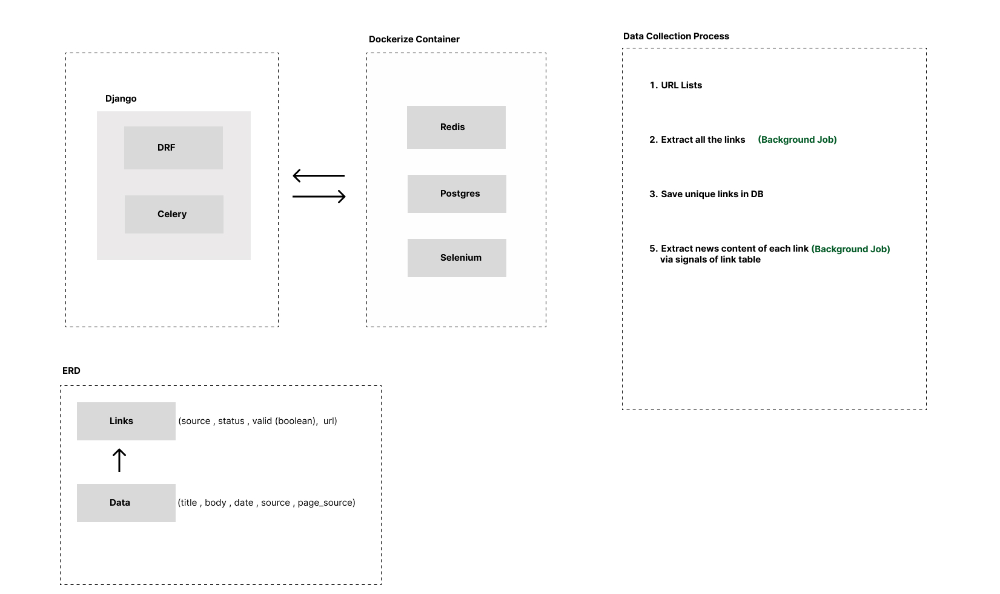

## Nepali News Scrapper

The Nepali News Scrapper is a Python-based repository that provides a web scraping solution for extracting news articles from popular Nepali news websites. The repository offers a collection of scripts and utilities that allow users to scrape news articles, retrieve relevant information, and store the data in a structured format.





### Key Features:

1. **Website Support**: The Nepali News Scrapper supports scraping news articles from multiple popular Nepali news websites. It provides predefined scraping scripts for each supported website, enabling users to extract articles effortlessly.

2. **Article Extraction**: The repository includes powerful web scraping techniques to extract article content, including the title, author, published date, and main body text. The extraction process is designed to handle different page layouts and ensures accurate retrieval of news article information.

3. **Public API**: The scraped news articles can be accesed through api for provided dates.

5. **Ease of Use**: The repository is designed to be user-friendly, even for individuals with limited programming experience. It includes detailed documentation and examples to guide users through the setup process and demonstrate the usage of various scraping functionalities.

6. **Community Contributions**: The Nepali News Scrapper repository welcomes contributions from the open-source community. Users can contribute by adding support for new Nepali news websites, improving the scraping algorithms, or enhancing the existing functionality to provide a better user experience.

### Getting Started:

To get started with the Nepali News Scrapper, users can simply clone the repository and follow the provided documentation. The repository contains detailed instructions on how to install dependencies, configure the scraping scripts, and run the scraping process. Additionally, there are code examples and tutorials to help users understand and utilize the various features of the scrapper effectively.

With the Nepali News Scrapper repository, developers and data enthusiasts can easily collect and extract news articles from popular Nepali news websites. Whether for research, analysis, or creating a news aggregation platform, this repository provides a reliable and flexible solution for gathering news data in the Nepali language.

**Note:** It is essential to review and respect the terms of service and legal considerations of the targeted websites when using web scraping tools.


## Workplan 

List of Tasks 

1. Scrape news from online news portal 
2. Store them in database 
3. Run the process in background 
4. Watch news portal for any changes , if detected scrape only changes  and store 
5. These news must be accessible through api according to date provided 

Tech Stack :

1. Scrapping : selenium
2. Database : Postgres 
3. Background Jobs : Celery 
4. API Framework : DRF (Django)

selenium :

The Selenium Python package is a popular tool for automating web browsers. It provides a Python interface to interact with web browsers programmatically, allowing you to control and automate browser actions, such as clicking buttons, filling out forms, extracting data, and navigating through web pages.


## How System Development is done 


Artitecture Design 

1. Techstack 
2. Setup Stack

System Design 

1. Database Design
2. Endpoint Design 
3. Function Design 

Development 

1. Coding  
2. Test


```

Django Server : python manage.py runserver
Celery Worker : celery -A config beat -l info
Celery Beat : celery -A config beat -l info


Selenium Dopcker : 

docker run -d -p 4444:4444 -p 7900:7900 --shm-size="2g" --env SE_NODE_MAX_INSTANCES=4 --env SE_NODE_MAX_SESSIONS=4  selenium/standalone-firefox:latest


```

